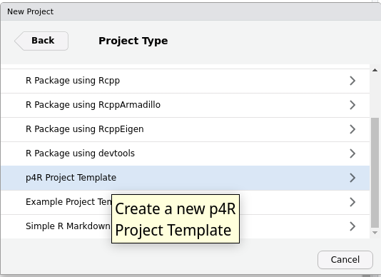

```{r setup, include=FALSE}
knitr::opts_chunk$set(echo = TRUE)
```

## About

RStudio project template to run parallel code in R, using foreach, doParallel and/or doMPI. 

## Install

To install this package in RStudio, you need `devtools` in R. Then, run the following. 

```{r eval=FALSE}
devtools::install_github("jlaria/p4R")
```

## Usage
To start a new project go to **File** -> **New Project ...** and then select **p4R Project Template**

